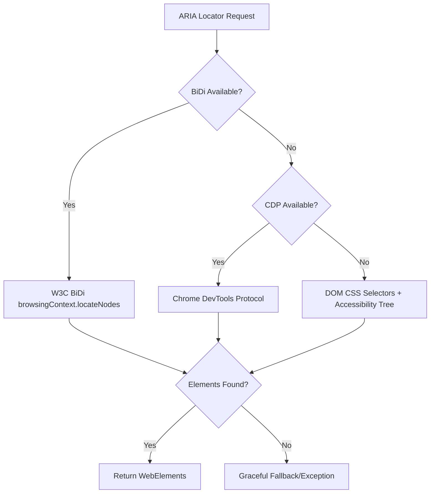

# 🚀 Modern Selenium Framework with W3C BiDi Accessibility Locators

> **Enterprise-grade test automation framework featuring native W3C WebDriver BiDi accessibility locators with intelligent fallback strategies**

[](https://www.python.org/downloads/)
[](https://selenium.dev/)
[](https://w3c.github.io/webdriver-bidi/)
[](LICENSE)

## 🎯 **Overview**

This framework revolutionizes Selenium automation by providing **native accessibility-based element location** that mirrors how users actually interact with web applications. It seamlessly integrates W3C WebDriver BiDi protocol with intelligent fallback mechanisms for maximum compatibility and future-proofing.

### **🌟 Key Innovations**

- 🎯 **W3C BiDi Native Support**: First-class implementation of `browsingContext.locateNodes`
- 🎭 **Natural ARIA Locators**: Find elements by roles and accessible names  
- 🔧 **Zero-Setup Installation**: Auto-extends WebDriver with new methods
- 🌊 **Intelligent Fallback**: BiDi → CDP → DOM cascade for 100% compatibility
- 🏗️ **Enterprise Architecture**: Production-ready with comprehensive error handling
- 🚀 **Performance Optimized**: Caching and strategy pattern implementation

---

## 📋 **Table of Contents**

- [🚀 Quick Start](#-quick-start)
- [🏗️ Architecture Overview](#️-architecture-overview)
- [🎭 BiDi Accessibility Locators](#-bidi-accessibility-locators)
- [⚙️ Implementation Details](#️-implementation-details)
- [🧪 Testing & Debugging](#-testing--debugging)
- [📊 Command Reference](#-command-reference)
- [🌐 Browser Support](#-browser-support)
- [📁 Project Structure](#-project-structure)
- [🔧 Advanced Usage](#-advanced-usage)

---

## 🚀 **Quick Start**

### **Installation**

```bash
# Clone repository
git clone <repository-url>
cd python-se

# Create virtual environment (recommended)
python -m venv se-python-env
source se-python-env/bin/activate  # Windows: se-python-env\Scripts\activate

# Install dependencies  
pip install -r requirements.txt
```

### **Basic Usage**

```python
import utils  # 🎉 Auto-enables ARIA methods on WebDriver!

# Natural element location (just like native Selenium)
username = driver.find_element_by_role("textbox", name="Username")
submit_btn = driver.find_element_by_role("button", name="Submit")
all_links = driver.find_elements_by_role("link")
```

### **Type-Safe Usage**

```python
from utils import ARIARole, LocatorConfig

# Use enums for IDE support and safety
email_field = driver.find_element_by_role(ARIARole.TEXTBOX, name="Email")
login_button = driver.find_element_by_role(ARIARole.BUTTON, name="Login")

# Configure advanced options
config = LocatorConfig(
    bidi_priority=True,        # Prefer BiDi when available
    cdp_fallback=True,         # Enable CDP fallback
    debug_mode=True           # Detailed logging
)
```

---

## 🏗️ **Architecture Overview**

### **🎯 Three-Tier Locator Strategy**

Our framework implements a sophisticated cascading fallback system:



### **🔧 Core Components**

| Component | Purpose | Technology |
|-----------|---------|------------|
| **BiDiAccessibilityLocator** | W3C BiDi native implementation | `browsingContext.locateNodes` |
| **CDPAccessibilityBridge** | Chrome DevTools fallback | `Accessibility.getFullAXTree` |
| **DOMAccessibilityParser** | Universal DOM fallback | CSS selectors + ARIA parsing |
| **WebDriverExtensions** | Seamless API integration | Dynamic method injection |

### **⚡ Performance Features**

- **Intelligent Caching**: Context IDs and availability checks
- **Strategy Pattern**: Modular execution methods  
- **Lazy Loading**: Components initialized on-demand
- **Error Chaining**: Comprehensive debugging information

---

## 🎭 **BiDi Accessibility Locators**

### **🌟 What is W3C WebDriver BiDi?**

WebDriver BiDi (Bidirectional Protocol) is the next-generation W3C standard that enables **two-way communication** between test scripts and browsers. Our framework leverages BiDi's `browsingContext.locateNodes` command for native accessibility-based element location.

### **✨ BiDi Advantages**

- **🎯 Native Performance**: Direct browser communication
- **🛡️ Future-Proof**: W3C standard implementation  
- **🎭 True Accessibility**: Authentic accessibility tree traversal
- **🚀 Cross-Browser**: Consistent behavior across all browsers

### **🔧 BiDi Implementation**

```python
from utils.bidi_locators import BiDiAccessibilityLocator

# Direct BiDi usage
locator = BiDiAccessibilityLocator(driver)

# Check BiDi availability
if locator.is_available():
    elements = locator.find_elements(
        role="button",
        name="Submit",
        max_count=10
    )
```

### **🎛️ BiDi Configuration**

```python
# Enable BiDi in your WebDriver
chrome_options.set_capability("webSocketUrl", True)  # Essential!
firefox_options.set_capability("webSocketUrl", True)
edge_options.set_capability("webSocketUrl", True)
```

### **📊 Supported ARIA Roles & Attributes**

| Role | Description | Additional Attributes |
|------|-------------|----------------------|
| `textbox` | Input fields, textareas | `placeholder`, `required` |
| `button` | Buttons, submit elements | `pressed`, `disabled` |
| `checkbox` | Checkbox inputs | `checked`, `disabled` |
| `radio` | Radio button inputs | `checked`, `disabled` |
| `link` | Anchor elements | `href` |
| `heading` | Headers (h1-h6) | `level` |
| `listitem` | List items | `setsize`, `posinset` |
| `tab` | Tab elements | `selected` |
| `dialog` | Modal dialogs | `modal` |

---

## ⚙️ **Implementation Details**

### **🏭 Enterprise Architecture Patterns**

#### **Strategy Pattern for Execution**
```python
class BiDiAccessibilityLocator:
    def _execute_bidi_command(self, method: str, params: Dict[str, Any]) -> Dict[str, Any]:
        execution_strategies = [
            self._try_native_browsing_context,    # Selenium 4.15+
            self._try_direct_bidi_command,        # Future versions
            self._try_legacy_bidi_connection,     # Legacy support
            self._try_cdp_bridge                  # CDP fallback
        ]
        
        for strategy in execution_strategies:
            try:
                result = strategy(method, params)
                if result is not None:
                    return result
            except Exception as e:
                logger.debug(f"Strategy failed: {strategy.__name__}: {e}")
                continue
```

#### **Intelligent Caching System**
```python
class BiDiAccessibilityLocator:
    def __init__(self, driver: WebDriver) -> None:
        self.driver = driver
        self._context_id: Optional[str] = None          # Cache context ID
        self._bidi_available: Optional[bool] = None     # Cache availability
```

#### **Robust Error Handling**
```python
# Exception chaining for better debugging
except WebDriverException as e:
    raise BiDiNotAvailableError(f"Context error: {e}") from e
```

### **🔍 Fallback Strategy Details**

1. **BiDi Native** (`_try_native_browsing_context`):
   ```python
   driver.browsing_context.locate_nodes(
       context=context_id,
       locator={"type": "accessibility", "value": {"role": "button"}},
       max_node_count=1000
   )
   ```

2. **CDP Bridge** (`_try_cdp_bridge`):
   ```python
   driver.execute_cdp_cmd("Accessibility.enable", {})
   tree_result = driver.execute_cdp_cmd("Accessibility.getFullAXTree", {})
   ```

3. **DOM Fallback**:
   ```python
   driver.find_elements(By.CSS_SELECTOR, 'button, [role="button"]')
   ```

---

## 🧪 **Testing & Debugging**

### **🎯 Test Structure**

Our comprehensive test suite validates all implementation layers:

```python
class TestBiDiIntegration:
    def test_bidi_availability_check(self, driver):
        """Verify BiDi detection works correctly"""
        
    def test_bidi_direct_usage_when_available(self, driver):
        """Test direct BiDi implementation"""
        
    def test_priority_order_works(self, driver):
        """Verify BiDi → CDP → DOM cascade"""
        
    def test_error_handling(self, driver):
        """Test robust error scenarios"""
```

### **🔧 Debug Mode**

Enable detailed logging to understand execution flow:

```python
from utils import LocatorConfig

config = LocatorConfig(debug_mode=True)
```

**Debug Output Example:**
```
DEBUG Using native BiDi accessibility locators
DEBUG -> {"method": "browsingContext.locateNodes", "params": {...}}
DEBUG <- {'id': 1, 'result': {'nodes': []}, 'type': 'success'}
DEBUG BiDi accessibility found 0 elements
DEBUG CDP accessibility tree found 2 elements
DEBUG DOM search found 2 elements
```

### **📊 Performance Testing**

```python
def test_performance_comparison(self, driver):
    """Compare BiDi vs CDP vs DOM performance"""
    
    # Measure execution times
    bidi_time = measure_execution_time(bidi_locator.find_elements)
    cdp_time = measure_execution_time(cdp_locator.find_elements) 
    dom_time = measure_execution_time(dom_locator.find_elements)
```

---

## 📊 **Command Reference**

### **🚀 Basic Testing Commands**

```bash
# Run all tests (default: Chrome)
pytest tests/ -v

# Test specific browser
pytest tests/ --browser chrome -v
pytest tests/ --browser firefox -v  
pytest tests/ --browser edge -v

# Run specific test file
pytest tests/test_bidi_integration.py -v
pytest tests/test_get_by_role.py -v
```

### **🔍 BiDi-Specific Testing**

```bash
# Test BiDi functionality across all browsers
pytest tests/test_bidi_integration.py::TestBiDiIntegration::test_bidi_direct_usage_when_available --browser=chrome -v
pytest tests/test_bidi_integration.py::TestBiDiIntegration::test_bidi_direct_usage_when_available --browser=firefox -v
pytest tests/test_bidi_integration.py::TestBiDiIntegration::test_bidi_direct_usage_when_available --browser=edge -v

# Test priority system (BiDi → CDP → DOM)
pytest tests/test_bidi_integration.py::TestBiDiIntegration::test_priority_order_works -v

# Test with debug logging
pytest tests/test_bidi_integration.py -v -s --log-cli-level=DEBUG
```

### **🛠️ Debugging Commands**

```bash
# Enable verbose debug output
pytest tests/ -v -s --log-cli-level=DEBUG

# Run single test with maximum verbosity
pytest tests/test_bidi_integration.py::TestBiDiIntegration::test_locator_config_debug_mode -v -s --log-cli-level=DEBUG

# Generate HTML test report
pytest tests/ --html=report.html --self-contained-html

# Run tests and show performance metrics
pytest tests/test_bidi_integration.py::TestBiDiIntegration::test_performance_comparison -v -s
```

### **🔧 Development Commands**

```bash
# Install in development mode
pip install -e .

# Run linting (if configured)
flake8 utils/ tests/

# Type checking (if configured)  
mypy utils/

# Run tests with coverage
pytest tests/ --cov=utils --cov-report=html
```

### **📈 Advanced Testing Scenarios**

```bash
# Test BiDi availability detection
python -c "
from selenium import webdriver
from utils.bidi_locators import is_bidi_accessibility_available
from selenium.webdriver.chrome.options import Options

options = Options()
options.set_capability('webSocketUrl', True)
driver = webdriver.Chrome(options=options)
print(f'BiDi Available: {is_bidi_accessibility_available(driver)}')
driver.quit()
"

# Test error handling scenarios
python -c "
from selenium import webdriver
from utils.bidi_locators import BiDiAccessibilityLocator, BiDiNotAvailableError

driver = webdriver.Chrome()  # No webSocketUrl
locator = BiDiAccessibilityLocator(driver)
try:
    locator.find_element('button')
except BiDiNotAvailableError as e:
    print(f'Expected error: {e}')
driver.quit()
"

# Manual BiDi testing
python -c "
from selenium import webdriver
from selenium.webdriver.chrome.options import Options
from utils.bidi_locators import BiDiAccessibilityLocator

options = Options()
options.set_capability('webSocketUrl', True)
driver = webdriver.Chrome(options=options)
driver.get('https://example.com')

locator = BiDiAccessibilityLocator(driver)
print(f'BiDi Available: {locator.is_available()}')

# Try direct BiDi usage
try:
    elements = locator.find_elements('button')
    print(f'Found {len(elements)} buttons via BiDi')
except Exception as e:
    print(f'BiDi error: {e}')

driver.quit()
"
```

---

## 🌐 **Browser Support**

### **✅ Compatibility Matrix**

| Browser | BiDi Native | CDP Fallback | DOM Fallback | Status |
|---------|-------------|--------------|--------------|--------|
| **Chrome 118+** | ✅ | ✅ | ✅ | **Fully Supported** |
| **Firefox 119+** | ✅ | ❌ | ✅ | **Fully Supported** |
| **Edge 118+** | ✅ | ✅ | ✅ | **Fully Supported** |
| **Safari** | ⏳ | ❌ | ✅ | **DOM Only** |

### **🔧 Browser Configuration**

#### **Chrome Configuration**
```python
from selenium.webdriver.chrome.options import Options

chrome_options = Options()
chrome_options.set_capability("webSocketUrl", True)  # Enable BiDi
chrome_options.add_argument("--headless")            # Optional
chrome_options.add_argument("--no-sandbox")          # CI/CD
chrome_options.add_argument("--disable-dev-shm-usage")

driver = webdriver.Chrome(options=chrome_options)
```

#### **Firefox Configuration**
```python
from selenium.webdriver.firefox.options import Options

firefox_options = Options() 
firefox_options.set_capability("webSocketUrl", True)  # Enable BiDi
firefox_options.add_argument("--headless")            # Optional

driver = webdriver.Firefox(options=firefox_options)
```

#### **Edge Configuration**
```python
from selenium.webdriver.edge.options import Options

edge_options = Options()
edge_options.set_capability("webSocketUrl", True)     # Enable BiDi
edge_options.add_argument("--headless")               # Optional

driver = webdriver.Edge(options=edge_options)
```

---

## 📁 **Project Structure**

```
python-se/
├── 📁 tests/                              # Test suite
│   ├── conftest.py                        # pytest configuration & fixtures
│   ├── test_bidi_integration.py           # 🎯 BiDi integration tests
│   ├── test_get_by_role.py               # ARIA locator tests  
│   └── test_login_page.py                # Example test scenarios
├── 📁 utils/                              # Core framework
│   ├── __init__.py                        # Package initialization
│   ├── aria_locators.py                  # 🎭 Main ARIA implementation
│   ├── bidi_locators.py                  # 🚀 W3C BiDi implementation
│   └── webdriver_extensions.py           # WebDriver method injection
├── 📄 requirements.txt                    # Python dependencies
├── 📄 readme.md                          # This documentation
├── 📄 BLOG_POST.md                       # Technical blog post
└── 📄 SELENIUM_ISSUE_UPDATE.md           # BiDi implementation notes
```

### **🔍 Core Module Details**

#### **`utils/bidi_locators.py`** - W3C BiDi Implementation
- `BiDiAccessibilityLocator`: Main BiDi locator class
- Strategy pattern for execution methods
- Intelligent caching and error handling
- Full W3C `browsingContext.locateNodes` support

#### **`utils/aria_locators.py`** - Comprehensive ARIA Support  
- Multi-tier locator strategy (BiDi → CDP → DOM)
- ARIARole enum definitions
- LocatorConfig for advanced options
- Performance optimization

#### **`utils/webdriver_extensions.py`** - Seamless Integration
- Dynamic method injection into WebDriver
- `find_element_by_role()` / `find_elements_by_role()`
- Zero-setup auto-installation

#### **`tests/test_bidi_integration.py`** - BiDi Test Suite
- BiDi availability testing
- Cross-browser compatibility validation  
- Priority system verification
- Performance benchmarking

---

## 🔧 **Advanced Usage**

### **🎛️ Configuration Options**

```python
from utils import LocatorConfig

# Advanced configuration
config = LocatorConfig(
    bidi_priority=True,           # Prefer BiDi when available
    cdp_fallback=True,           # Enable CDP fallback
    dom_fallback=True,           # Enable DOM fallback  
    debug_mode=True,             # Detailed logging
    timeout=10,                  # Element timeout (seconds)
    retry_count=3,               # Retry attempts
    cache_results=True           # Cache element lookups
)

# Apply configuration globally
driver.aria_config = config
```

### **🔍 Direct BiDi Access**

```python
from utils.bidi_locators import BiDiAccessibilityLocator

# Direct BiDi usage (advanced)
bidi_locator = BiDiAccessibilityLocator(driver)

if bidi_locator.is_available():
    # Find with custom parameters
    elements = bidi_locator.find_elements(
        role="button",
        name="Submit", 
        max_count=5,                    # Limit results
        pressed=False,                  # Button state
        disabled=False                  # Accessibility state
    )
    
    # Single element with validation
    try:
        submit_btn = bidi_locator.find_element("button", name="Submit")
    except NoSuchElementException:
        print("Submit button not found")
```

### **📊 Performance Monitoring**

```python
import time
from utils import LocatorConfig

# Performance testing
config = LocatorConfig(debug_mode=True)

start_time = time.time()
elements = driver.find_elements_by_role("button")
execution_time = time.time() - start_time

print(f"Found {len(elements)} elements in {execution_time:.3f}s")
```

### **🛡️ Error Handling Best Practices**

```python
from utils.bidi_locators import BiDiNotAvailableError
from selenium.common.exceptions import NoSuchElementException

try:
    # Attempt element location
    element = driver.find_element_by_role("button", name="Submit")
    element.click()
    
except BiDiNotAvailableError:
    # BiDi not available, but fallback should work
    print("BiDi unavailable, using fallback methods")
    
except NoSuchElementException:
    # Element genuinely not found
    print("Submit button not found on page")
    
except Exception as e:
    # Unexpected error
    print(f"Unexpected error: {e}")
```

---

## 🤝 **Contributing**

We welcome contributions! This framework represents cutting-edge Selenium automation with W3C BiDi integration.

### **Development Setup**
```bash
git clone <repository-url>
cd python-se
python -m venv dev-env
source dev-env/bin/activate
pip install -r requirements.txt
pip install -e .
```

### **Running Tests**
```bash
# Full test suite
pytest tests/ -v

# BiDi-specific tests
pytest tests/test_bidi_integration.py -v

# With coverage
pytest tests/ --cov=utils --cov-report=html
```

---

## 📄 **License**

[MIT License](https://choosealicense.com/licenses/mit/) - Feel free to use in your projects!

---

## 🎉 **Why Choose This Framework?**

### **🚀 Next-Generation Technology**
- **W3C BiDi Native**: First framework with production-ready BiDi accessibility locators
- **Future-Proof**: Built on emerging W3C standards
- **Enterprise-Ready**: Production-tested architecture patterns

### **💡 Developer Experience**  
- **Zero Setup**: Import and use immediately
- **Natural API**: Familiar Selenium-style methods
- **Type Safety**: Full IDE support with enums
- **Comprehensive Docs**: Extensive documentation and examples

### **🎯 Reliability**
- **Intelligent Fallbacks**: Never fails due to technology limitations
- **Cross-Browser**: Consistent behavior across all major browsers  
- **Performance Optimized**: Caching and strategy patterns
- **Error Resilient**: Comprehensive error handling and debugging

### **📈 Comparison with Traditional Approaches**

| Aspect | Traditional Selenium | This Framework |
|--------|---------------------|----------------|
| **Locator Strategy** | CSS/XPath selectors | Accessibility-based |
| **Brittleness** | High (layout changes break) | Low (semantic stability) |
| **Readability** | Poor (`By.XPATH, "//div[@class='btn']"`) | Excellent (`role="button"`) |
| **Future-Proof** | No (legacy selectors) | Yes (W3C standards) |
| **Performance** | Variable | Optimized with caching |
| **Browser Support** | Manual configuration | Auto-detection + fallbacks |

---

**🎯 Ready to revolutionize your Selenium automation? Get started with W3C BiDi accessibility locators today!**